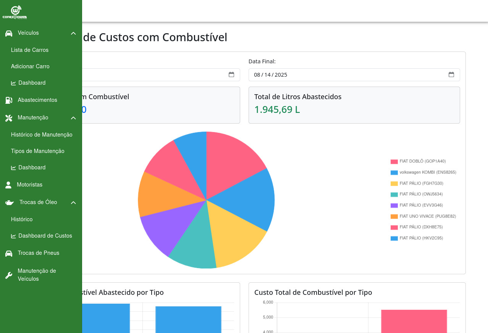
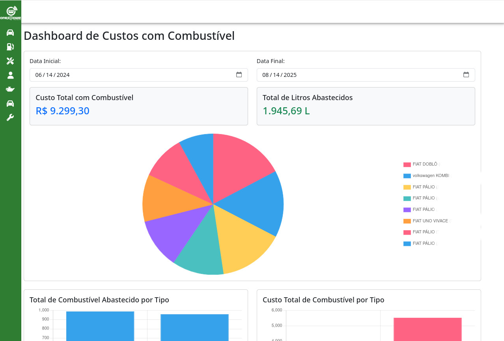
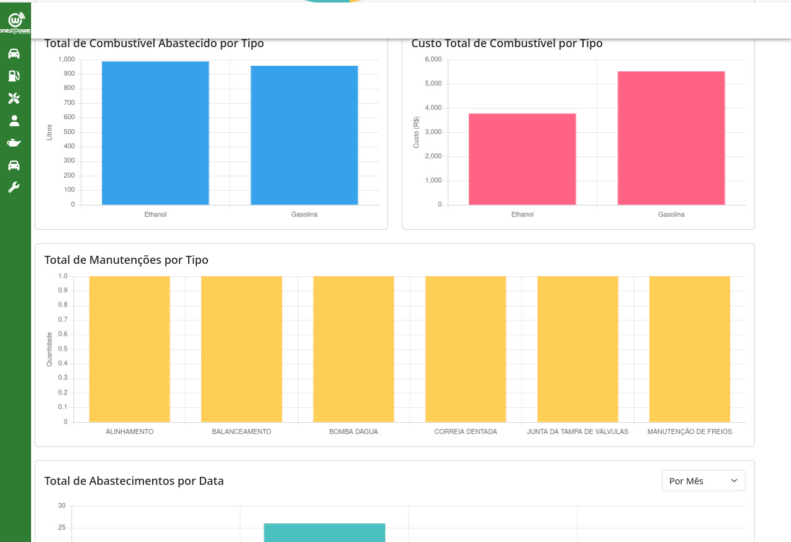
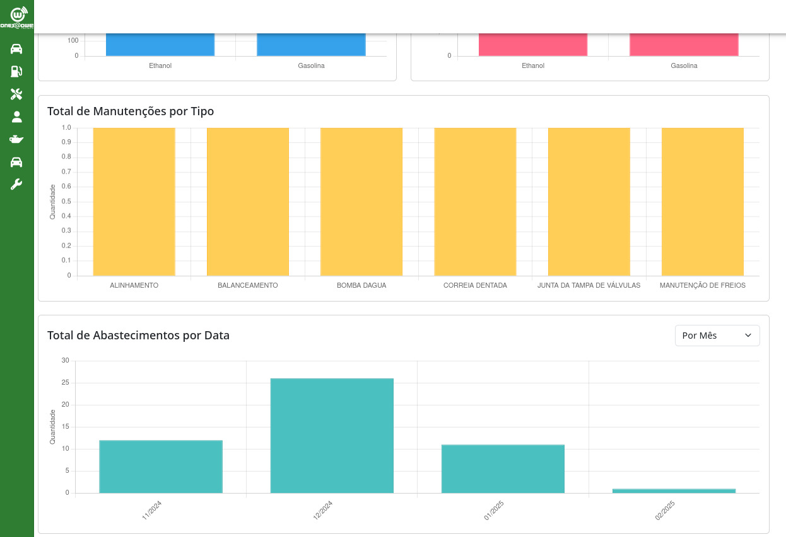

# SmartFleet

SmartFleet é um sistema abrangente de gerenciamento de frotas que ajuda as organizações a gerenciar eficientemente suas frotas de veículos, rastrear a manutenção e otimizar as operações.

## 🚀 Funcionalidades

- Rastreamento e monitoramento de veículos em tempo real
- Agendamento e gerenciamento de manutenção da frota
- Gerenciamento de motoristas e rastreamento de desempenho
- Análise de consumo de combustível
- Rastreamento do histórico de manutenção
- Painel de relatórios e análises

## 🏗️ Estrutura do Projeto

O projeto está organizado em três componentes principais:

```
gerenciamento-de-frotas/
├── frontend/     # Aplicação web baseada em React
├── backend/      # Servidor de API REST Node.js
└── database/     # Migrações e esquemas de banco de dados
```

## 🛠️ Stack

### Frontend
- React.js com TypeScript
- Material-UI para componentes
- Redux para gerenciamento de estado
- Axios para comunicação com a API

### Backend
- Node.js
- Express.js
- Jest para testes
- JWT para autenticação

### Banco de Dados
- MySQL
- mysql2 (cliente MySQL Node.js)

## 🚦 Primeiros Passos

### Pré-requisitos

- Node.js (v14 ou superior)
- npm ou yarn
- MySQL (v8.0 ou superior)

### Instalação

1. Clone o repositório:
```bash
git clone https://github.com/rafael-calixto1/gerenciamento-de-frotas.git
cd gerenciamento-de-frotas
```

2. Configure o backend:
```bash
cd backend
npm install
cp .env.example .env
# Configure seu arquivo .env com os valores apropriados
```

3. Configure o frontend:
```bash
cd ../frontend
npm install
cp .env.example .env
# Configure seu arquivo .env com os valores apropriados
```

4. Configure o banco de dados:
```bash
cd ../database
# Siga as instruções de configuração do banco de dados em database/README.md
```

## 📸 Pré-visualização






### Executando a Aplicação

1. Inicie o servidor backend:
```bash
cd backend
npm run dev
```

2. Inicie o servidor de desenvolvimento frontend:
```bash
cd frontend
npm start
```

A aplicação estará disponível em `http://localhost:3000`

## 📚 Documentação

- [Documentação do Frontend](./frontend/README.md)
- [Documentação do Backend](./backend/README.md)

## 🧪 Testes

### Testes de Backend
```bash
cd backend
npm test
```

### Testes de Frontend
```bash
cd frontend
npm test
```

## 🤝 Contribuindo

1. Faça um fork do repositório
2. Crie sua branch de funcionalidade (`git checkout -b feature/AmazingFeature`)
3. Faça commit de suas alterações (`git commit -m 'Adicione alguma AmazingFeature'`) 
4. Envie para a branch (`git push origin feature/AmazingFeature`)
5. Abra um Pull Request

## 📄 Licença

Este projeto está licenciado sob a Licença MIT - veja o arquivo [LICENSE](LICENSE) para detalhes.
